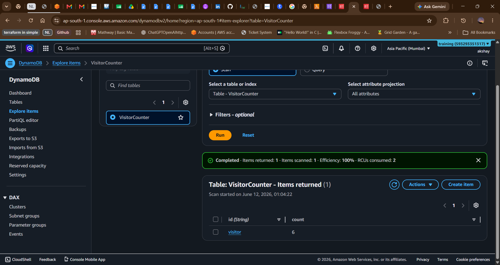
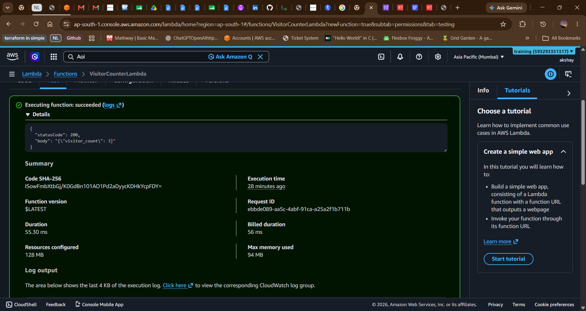
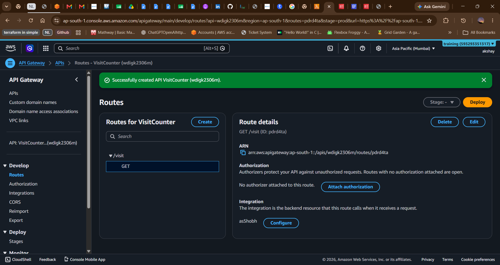
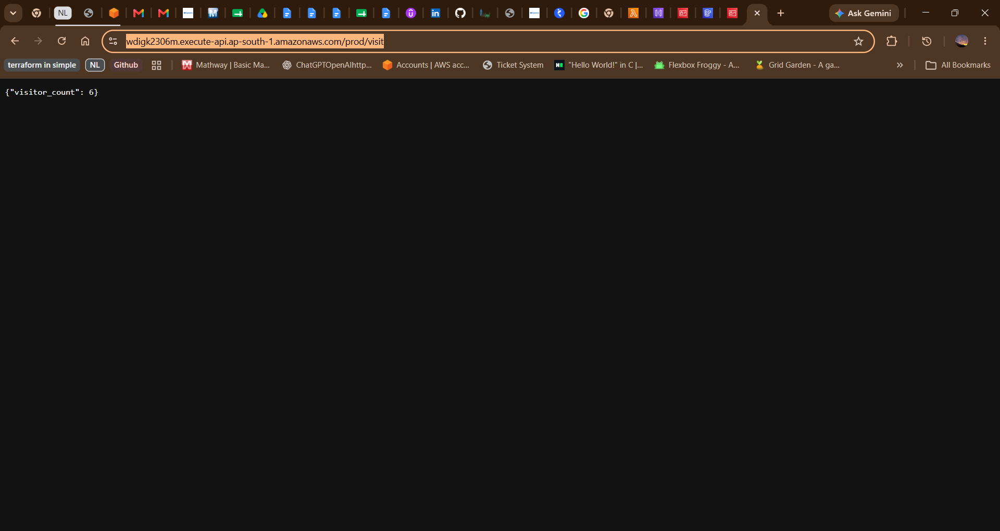

# AWS Serverless Visitor Counter

## Overview

A serverless visitor counter built using AWS Lambda, API Gateway, and DynamoDB.

Every API request increments the visitor count and stores the updated value in DynamoDB.

## Architecture

API Gateway → Lambda → DynamoDB

## AWS Services Used

- AWS Lambda
- Amazon DynamoDB
- Amazon API Gateway
- IAM
- CloudWatch

## Features

- Increment visitor count
- Store count in DynamoDB
- Expose public API endpoint
- Serverless architecture

### DynamoDB Table

### Lambda Test

### API Gateway

### Browser Response

## Sample Response

{
  "visitor_count": 10
}

## Future Enhancements

- Frontend integration
- CI/CD using GitHub Actions
- Infrastructure as Code using Terraform
- Custom domain
