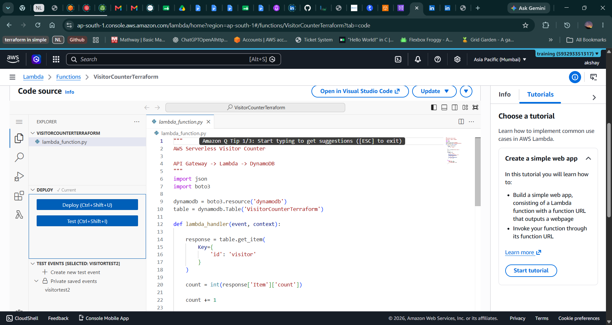

# AWS Serverless Visitor Counter

## Overview

A serverless visitor counter application built using AWS Lambda, API Gateway, DynamoDB, IAM, and Terraform.

The application exposes a public API endpoint that increments and returns the current visitor count. All infrastructure components are provisioned and managed using Terraform.

---

## Architecture

```text
Client
   ↓
API Gateway
   ↓
AWS Lambda
   ↓
Amazon DynamoDB
```

---

## Technologies Used

### Cloud Services

* AWS Lambda
* Amazon API Gateway
* Amazon DynamoDB
* AWS IAM
* Amazon CloudWatch

### Infrastructure as Code

* Terraform

### Programming Language

* Python 3.13

### Version Control

* Git
* GitHub

---

## Features

* Serverless architecture
* Public API endpoint
* Visitor count tracking
* DynamoDB data persistence
* Infrastructure provisioning using Terraform
* CloudWatch logging
* IAM-based access control

---

## Project Structure

```text
aws-serverless-visitor-counter/
│
├── lambda/
│   ├── lambda_function.py
│   └── visitor-counter.zip
│
├── terraform/
│   ├── main.tf
│   └── .terraform.lock.hcl
│
├── screenshots/
│
├── README.md
└── .gitignore
```

---

## Infrastructure Provisioned by Terraform

The following resources are created and managed using Terraform:

* DynamoDB Table
* Lambda Function
* IAM Role
* IAM Policies
* API Gateway
* API Gateway Route
* Lambda Permissions

---

## API Endpoint

### Request

```http
GET /visit
```

### Sample Response

```json
{
  "visitor_count": 20
}
```

---

## Deployment

### Initialize Terraform

```bash
terraform init
```

### Validate Configuration

```bash
terraform validate
```

### Review Changes

```bash
terraform plan
```

### Deploy Infrastructure

```bash
terraform apply
```

### Destroy Infrastructure

```bash
terraform destroy
```

---

## Screenshots

### DynamoDB Table


### Lambda Function



### API Gateway


### Terraform Apply Output


### Browser/API Response


---

## Learning Outcomes

This project demonstrates:

* Infrastructure as Code (Terraform)
* Serverless Application Development
* AWS Lambda Deployment
* API Gateway Integration
* DynamoDB Operations
* IAM Role and Policy Management
* Terraform State Management
* Git and GitHub Version Control

---

## Future Improvements

* Use Lambda Environment Variables
* Split Terraform configuration into multiple files
* Configure Remote Terraform State using S3
* Add GitHub Actions CI/CD Pipeline
* Add Custom Domain for API Gateway
* Add Monitoring and Alerting
* Implement Automated Testing

---

## Author

Akshay Sunil
